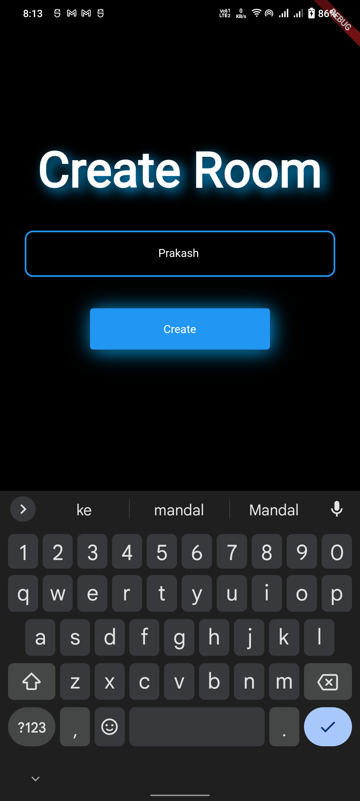
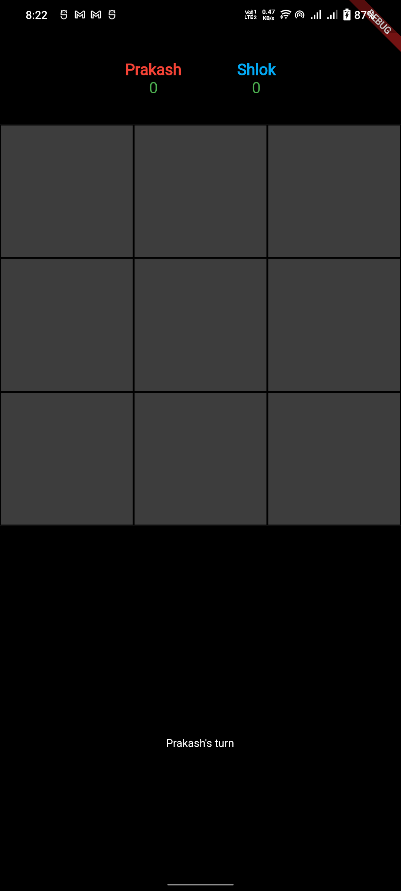
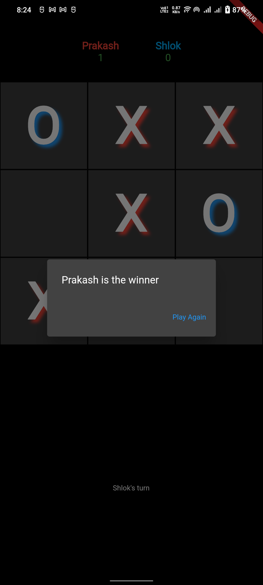
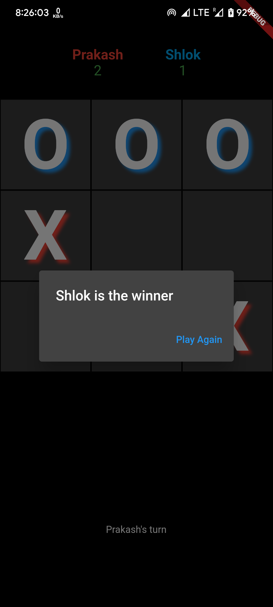

# multiplayer-tic-tac-toe

## Simple Multiplayer Tic-tac-toe game made with Flutter, Node, Express and Socket.io.  

***
# APK: 
[Multiplayer TicTacToe](https://github.com/ShlokBharadwaj/multiplayer-tic-tac-toe/releases/tag/v1.0.0).

# Screenshots:  
<table style={border: "none"}>
<tr>
<td></td>
<td></td>
<td></td>
</tr>

<tr>
<td></td>
<td></td>
<td></td>
</tr>

<tr>
<td></td>
<td></td>
<td></td>
</tr>

</table>